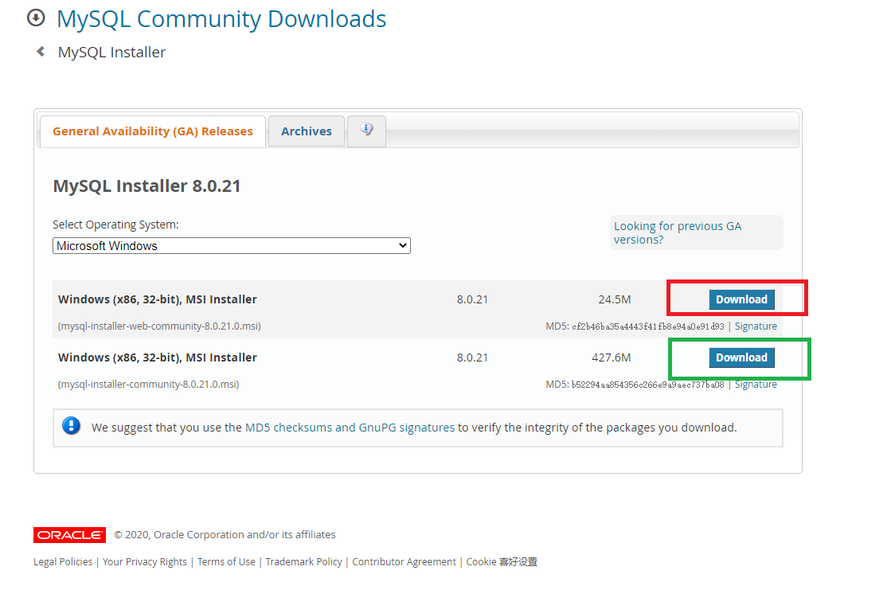
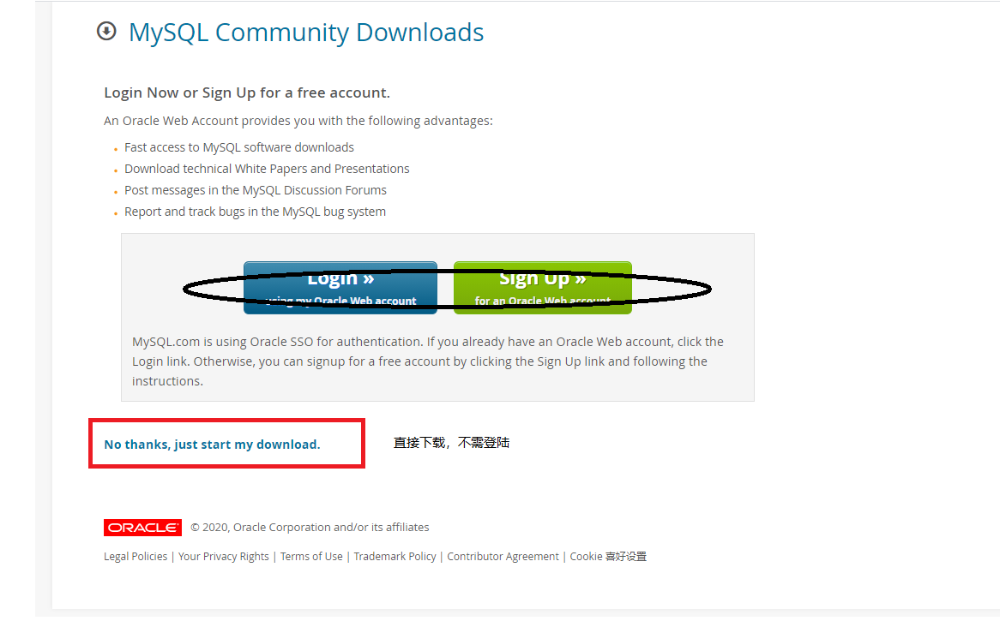
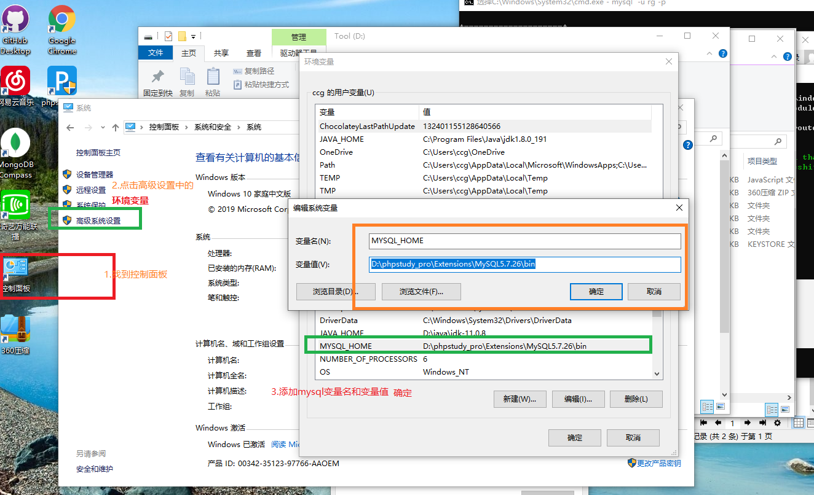
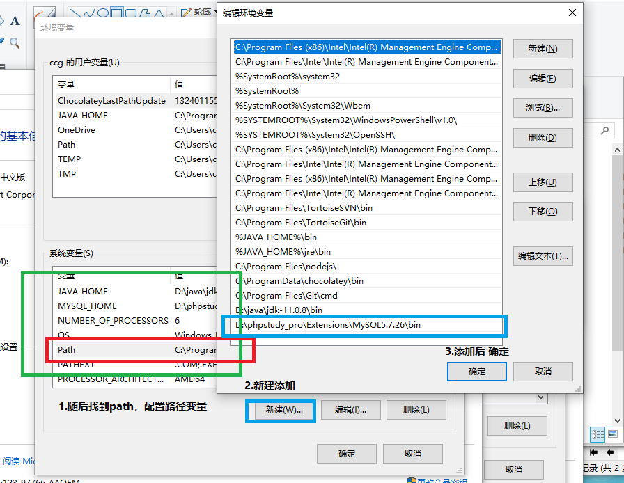
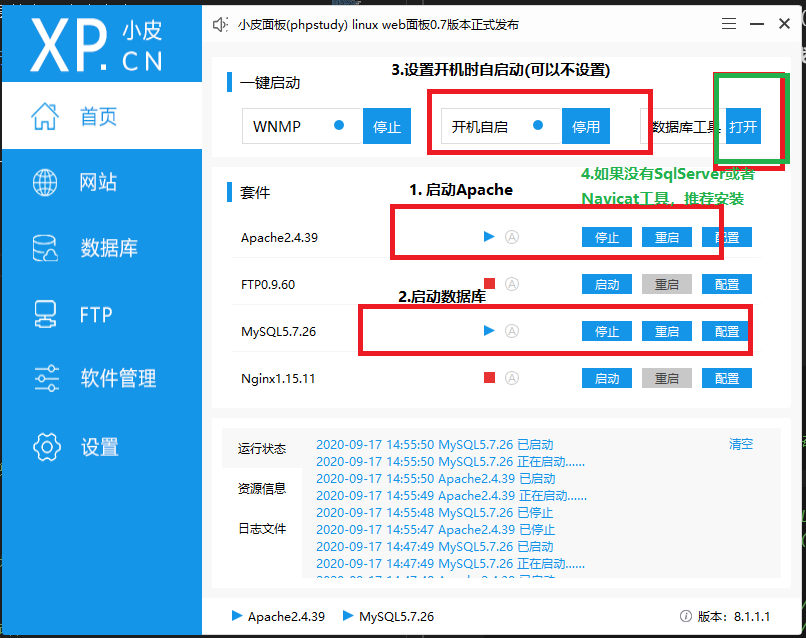
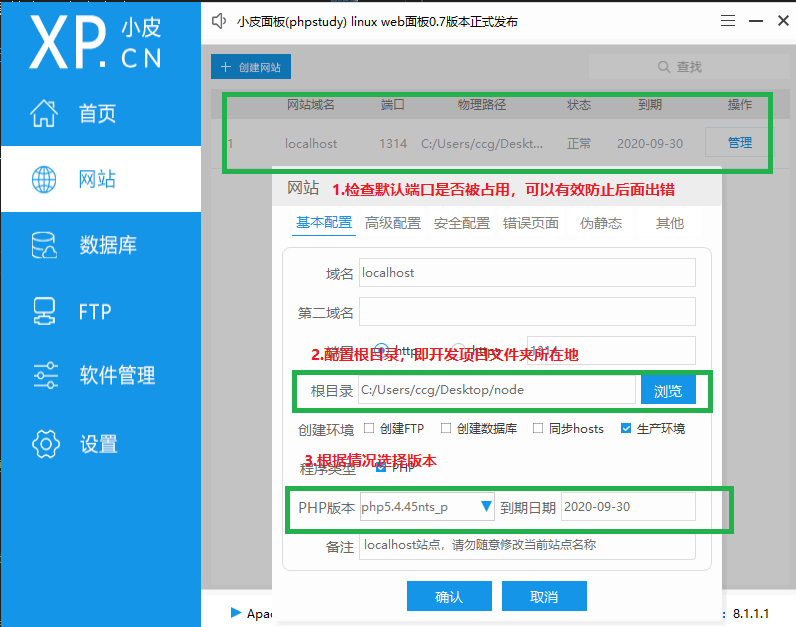
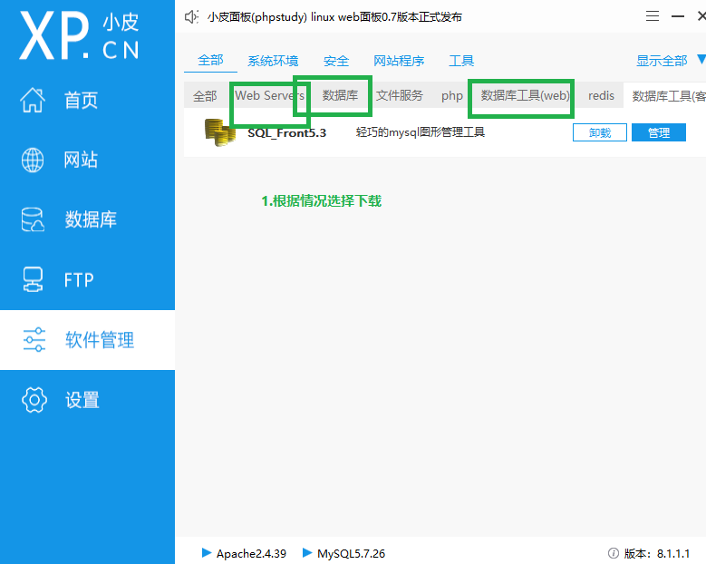
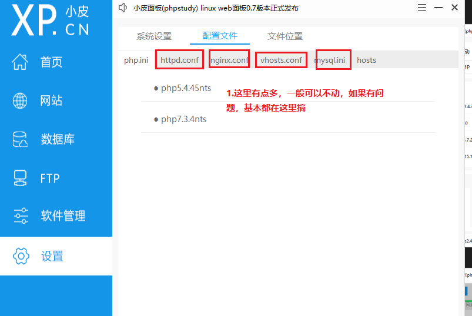

# MySQL 学习

### 安装

#### 第一种、直接从官网下载安装

#### 1. 安装流程

- 1. mysql[下载路径](https://dev.mysql.com/downloads/windows/installer/8.0.html)；
  2. 根据自身操作系统进行选择
  3. **流程如下**
  - 1. 选择版本
  - 2. 下载版本
  - 3. 找到文件所在目录，解压安装
  - 4. 进入 mysql 知道 bin 位置，将此段路径复制，配置环境变量（_主要是安装 mysql 环境，使其 mysqld 命令能被使用_）。
    - 1. 具体配置 1，如图所示：
    - 2. 具体配置 2，如图所示：
  - 5. 配置完毕，进入 bin 所在文件夹，在其同级下面新建一个文件：**my.ini**，

**my.ini 具体内容信息如下**

```ini
[mysql]
default-character-set=utf8
#这种文件，网上很多，根据各自需要进行更改
[mysqld]
port=3306
#根据自身安装的路径进行替换
basedir=D:/phpstudy_pro/Extensions/MySQL5.7.26/
datadir=D:/phpstudy_pro/Extensions/MySQL5.7.26/data/
character-set-server=utf8
default-storage-engine=MyIsam
max_connections=1000
collation-server=utf8_unicode_ci
init_connect='SET NAMES utf8'
innodb_buffer_pool_size=64M
innodb_flush_log_at_trx_commit=1
innodb_lock_wait_timeout=120
innodb_log_buffer_size=4M
innodb_log_file_size=256M
interactive_timeout=2880000
join_buffer_size=2M
key_buffer_size=32M
log_error_verbosity=1
max_allowed_packet=500M
max_heap_table_size=64M
myisam_max_sort_file_size=64G
myisam_sort_buffer_size=32M
read_buffer_size=512kb
read_rnd_buffer_size=4M
server_id=1
skip-external-locking=on
sort_buffer_size=256kb
table_open_cache=256
thread_cache_size=16
tmp_table_size=64M
wait_timeout=2880000
#根据自身安装的路径进行替换
log-error=D:/phpstudy_pro/Extensions/MySQL5.7.26/data

[client]
port=3306
default-character-set=utf8
```

#### 2. mysqld 操作

通过 cmd 管理员启动，cd /d D:\bin，运行命令（路径不一定是一致的）

- 1. mysqld --initialize --console 查看初始用户信息（可以看到用户名密码）
- 2. mysqld install 安装数据库
- 3. net start mysql 启动数据库
- 4. net stop mysql 关闭数据库
- 5. sc delete mysql 删除数据库服务器（主要是出现用户对接不上数据库时使用）
- 6. mysql -u root -p 进入数据库（需要输入用户名和密码）

**ps:需要进行其他 mysqld 操作，请自行查找**

#### 第二种、下载 phpstady 安装(推荐)

- 1. phpstady [下载路径](https://www.xp.cn/download.html)
  2. 版本选择
  3. 解压安装（与第一种一样）
  4. 环境配置（与第一种一样）
  5. 启动 phpstady（开启本地服务器），详情如下：
  - 1. 主界面配置
    2. 网站配置
    3. 软件管理配置
    4. 设置面配置
  6. 安装结束

#### 容易出现的问题

- 如果使用 phpstady 是可以不用配置环境变量的，但是，就不能使用 mysqld 命令
- 如果配置环境变量了，发现 MySQL 启动不了，解决如下：
  - 以管理员身份运行 cmd
  - 进入 mysqld 文件
  - 执行命令 **sc delete mysql** _删除数据库服务器_ 基本就可以了
